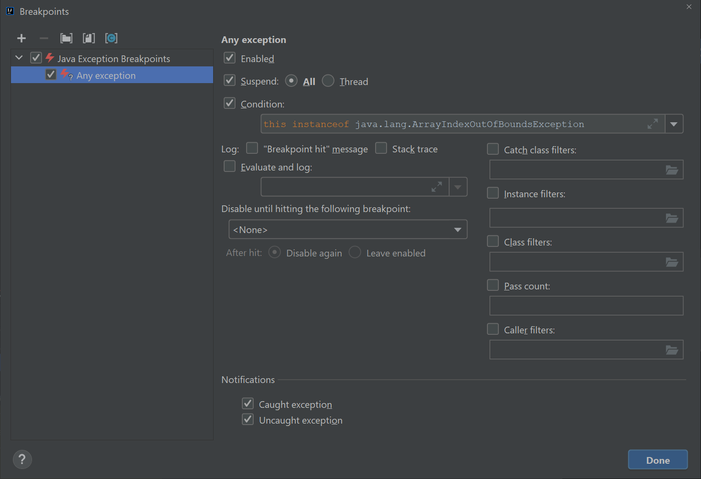

## 基本命令

```bash
/opt/idea-IU/bin/idea.sh # 先找到idea.sh文件夹, 然后直接运行(同样的命令行)找到IDE
```

## 基本资料

- [环境配置](https://docs.everlasting.xin/CS61B/2021Spring/projects/project-0-2048/#_4)
- [git命令](https://sp18.datastructur.es/materials/guides/using-git.html#staging--committing)
- [调试](https://sp21.datastructur.es/materials/guides/debugging-guide)
- [git协作1](https://sp19.datastructur.es/materials/guides/using-git.html#undoing-changes)
- [git协作2](https://sp19.datastructur.es/materials/guides/git-wtfs.html)


## 课程

### Test测试点

#### 注意点

1. 在每个测试方法前添加 @org.junit.Test，后面不写分号。
2. 把每个测试方法改为非静态方法。
3. 从 TestSort 类中删除 main 方法。
4. 文件顶部导入 
```bash
import org.junit.Test;
import static org.junit.Assert.*;
```
可以直接写 @Test /* 这是一个注释 */ 

#### Junit语法
```java
import org.junit.Test;
import org.junit.Before;

import static org.junit.Assert.*;

public class LinkedListDequeTest {

    @Test
    public void testSomething() {
        // 准备数据
        // 执行操作
        // 断言结果
    }
}
```

| 方法                                    | 检查内容          |
| ------------------------------------- | ------------- |
| `assertTrue(condition)`               | 条件应该为真        |
| `assertFalse(condition)`              | 条件应该为假        |
| `assertArrayEquals(expectedArray, actualArray)` | 数组应该相等 |
| `assertEquals(expected, actual)`      | 预期值和实际值相等     |
| `assertNotEquals(unexpected, actual)` | 两个值不应相等       |
| `assertArrayEquals(expected, actual)` | 两个数组内容相等      |
| `assertNull(object)`                  | 对象应该是 `null`  |
| `assertNotNull(object)`               | 对象不应是 `null`  |
| `assertSame(expected, actual)`        | 两个引用必须指向同一个对象 |
| `assertNotSame(unexpected, actual)`   | 两个引用不能指向同一个对象 |
| `fail(message)`                       | 主动让测试失败       |


### 比特规则

1. java所有的相等都遵循 复制比特
2. 除了8个基本类型以外都是引用类型
3. 每次创建引用类型, 都会分配盒子, 盒子里是地址
4. 给引用类型赋值之后, 地址盒子 -> 其他盒子(比如 体重double, 身高int), 称作指针盒子

-> 所以 在引用类型下, a = b, 会最终指向同一个盒子

5. 函数传递也遵循 复制比特

### 泛型

1. 在实现数据结构的 .java 文件中，只在文件顶部的类名后写一次泛型类型名称(自定)
```java
public class DLList<BleepBlorp> { }
```
2. 在使用该数据结构的其他 .java 文件中，声明变量时写出实际类型，实例化时使用空的菱形运算符
```java
DLList<Integer> d1 = new DLList<>(5);
```
3. 如果需要以基本类型为元素类型实例化泛型，请使用 Integer、Double、Character、Boolean、Long、Short、Byte 或 Float，而不是对应的基本类型

### 接口与类继承

#### 概念
1. 基本概念 : 子类, 超类

2. 变量类型
```java
List61B<String> lst = new SLList<String>();
```
其中变量 lst 的类型是 List61B，这称为它的“静态类型”     
lst 指向的对象类型是 SLList。这个对象本质上是 SLList，对象实例化时真正使用的类型称为它的“动态类型”

#### 接口文件
```java
package deque;

/** 接口继承 : 说明子类应该做什么 */
public interface Deque<T> {
    void addFirst(T item);

    void addLast(T item);

    default boolean isEmpty() {
        return size() == 0;
    }

    int size();

    void printDeque();

    T removeFirst();

    T removeLast();

    T get(int index);
}
```

#### 类文件
```java
public class LinkedListDeque <T> implements Deque<T> { }

@Override
public void addFirst(Item x) {
    insert(x, 0);
}
```

#### default

所有实现上位的类都能直接用
```java
/** 实现继承 : 说明子类应该怎么做 */
default public void print() {
    for (int i = 0; i < size(); i += 1) {
        System.out.print(get(i) + " ");
    }
    System.out.println();
}
```

如果我们希望 SLList 采用不同于接口默认实现的输出方式，因此需要重写。在 SLList 中实现：
```java
@Override
public void print() {
    for (Node p = sentinel.next; p != null; p = p.next) {
        System.out.print(p.item + " ");
    }
}
```
因为Java 运行一个被重写的方法时，会在对象的动态类型中寻找合适的方法签名并执行。

#### 重载函数
```java
public static void peek(List61B<String> list) {
    System.out.println(list.getLast());
}
public static void peek(SLList<String> list) {
    System.out.println(list.getFirst());
}

SLList<String> SP = new SLList<String>();
List61B<String> LP = SP;
peek(SP);
peek(LP);
```

**和上面规则的区别**
第一次调用 peek() 会使用第二个、参数为 SLList 的版本。第二次调用会使用第一个、参数为 List61B 的版本。原因是两个重载方法之间的区别只在参数类型。Java 判断调用哪个重载方法时，查看的是参数变量的静态类型，并选择具有相同参数类型的方法。

### 随机数
```java
/** 可能是课程库 */
import edu.princeton.cs.algs4.StdRandom;

/** 随机生成[0, 100) 的数字 */
StdRandom.uniform(0, 100)
```

### 调试报错时停下
Run -> View Breakpoints -> 


### 类与类继承extend

```java
public class RotatingSLList<Item> extends SLList<Item>
```

#### 子类构造方法

每个子类构造方法都必须先调用某个超类构造方法。
```java
public VengefulSLList() {
    super();
    deletedItems = new SLList<Item>();
}

public VengefulSLList(Item x) {
    super(x);
    deletedItems = new SLList<Item>();
}
```

#### super关键字

super 关键字可以用于调用超类构造方法，也可以调用被子类重写的超类方法。
```java
class Dog extends Animal {
    @Override
    public void speak() {
        super.speak();
        System.out.println("Woof");
    }
}
```

#### 编译错误

1. 编译器采取保守策略，只根据表达式的静态类型允许操作
```java
VengefulSLList<Integer> vsl2 = sl; // sl是SLList类, 编译器不允许超类直接赋给子类(SLList不一定是一个VengefulSLList)
```

2. 可以通过强制类型转换覆盖编译器的静态类型判断，但错误的转换可能导致运行时异常。

### 多态

Comparator 则更像一个独立的第三方机器，负责比较两个对象。一个类只能有一种 compareTo 自然顺序；如果需要多种比较方式，就应使用多个 Comparator
**自然顺序** : 某个类的 compareTo 方法所规定的默认排序方式

```java
import java.util.Comparator;

public class Dog implements Comparable<Dog> {
    ...
    public int compareTo(Dog uddaDog) {
        return this.size - uddaDog.size;
    }

    private static class NameComparator implements Comparator<Dog> {
        public int compare(Dog a, Dog b) {
            return a.name.compareTo(b.name);
        }
    }

    public static Comparator<Dog> getNameComparator() {
        return new NameComparator();
    }
}
```

### 迭代器

#### 调用过程
```java
List<Integer> friends = new ArrayList<Integer>();
...
Iterator<Integer> seer = friends.iterator();

while (seer.hasNext()) {
    System.out.println(seer.next());
}
```

**这里出现了两个不同接口：**
Iterable：表示某个对象可以被遍历；要求提供 iterator()，返回迭代器；
Iterator：表示真正执行遍历过程的对象；要求提供 hasNext() 和 next()。

#### 实现
```java
import java.util.Iterator;

public class ArraySet<T> implements Iterable<T> {
    public Iterator<T> iterator() {
        return new ArraySetIterator();
    }

    private class ArraySetIterator implements Iterator<T> {
        private int wizPos;

        public ArraySetIterator() {
            wizPos = 0;
        }

        public boolean hasNext() {
            return wizPos < size;
        }

        public T next() {
            T returnItem = items[wizPos];
            wizPos += 1;
            return returnItem;
        }
    }
}
```

### 抛出异常
```java
public V get(K key) {
    int location = findKey(key);
    if (location < 0) {
        throw new IllegalArgumentException(
            "Key " + key + " does not exist in map.");
    }
    return values[location];
}
```

### 泛型方法

**关键: T、K、V 不是特殊关键字，而是“类型变量”。使用之前必须先在某个作用域声明。**

#### 情况1: 类是泛型类
```java
class Box<T> {
    private T item;

    public T get() {
        return item;
    }
}
```

#### 情况二: 类是泛型类, 但是静态方法
```java
class Box<T> {
    public static <U> U getSomething(U x) {
        return x;
    }
}
```

#### 情况三: 类不是泛型类，方法想处理任意类型
```java
public static <K, V> V get(Map61B<K, V> map, K key) {
    if (map.containsKey(key)) {
        return map.get(key);
    }
    return null;
}

<K, V>类型说明 要写在返回类型前面
```

#### 情况四: 泛型方法, 但是想比较
```java
public static <K extends Comparable<K>, V>
K maxKey(Map61B<K, V> map) {
    ...
}

1. K extends Comparable<K> 表示：键类型必须实现 Comparable<K>，也就是能够与其他 K 比较。Comparable 本身也是泛型接口，所以必须写出 <K>，明确我们希望 K 与 K 比较。

2. 此处用 extends
这种用法称为类型上界（type upper bound）。请记住：

- 在类继承中，extends 建立继承并让子类获得超类能力；
- 在泛型声明中，extends 施加约束，要求类型参数必须属于某个上界。
用于泛型时，extends 是限制条件，而不是赋予新能力。
```


